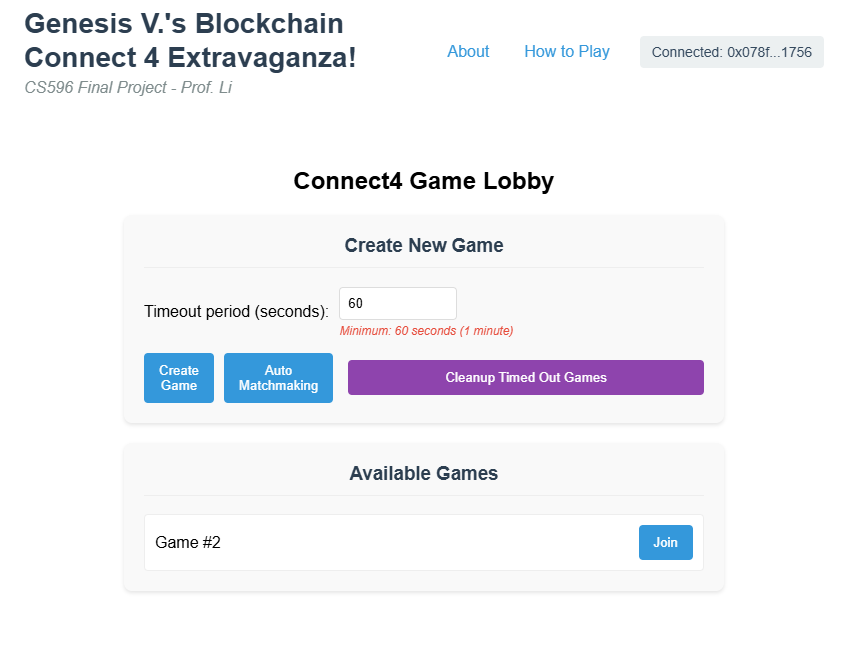
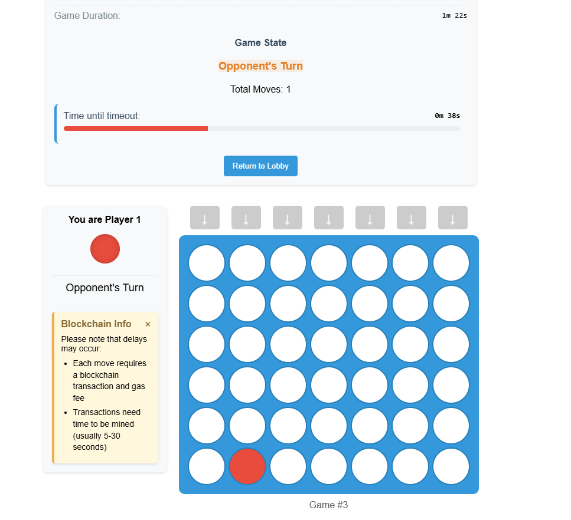
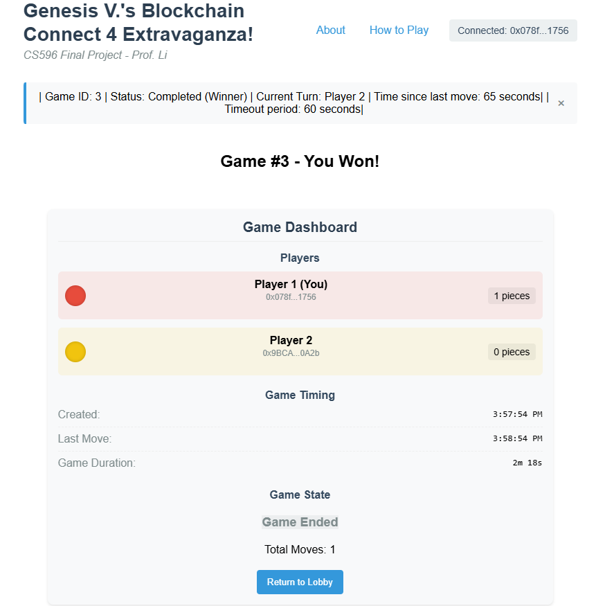
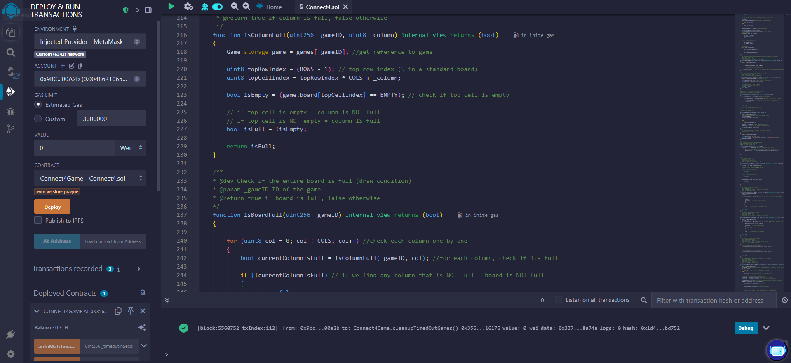

# Blockchain Connect4 Game

A decentralized implementation of the classic Connect4 game using blockchain technology. This project demonstrates how smart contracts can enable trustless gaming experiences with complete transparency and fairness.

**Live Demo(Deployed Website)**: [Play Blockchain Connect4](https://gilded-crepe-8a7bda.netlify.app/)

<div align="center">
  <table>
    <tr>
      <td></td>
      <td></td>
    </tr>
    <tr>
      <td></td>
      <td></td>
    </tr>
  </table>
</div>

## Project Overview

This decentralized Connect4 game was created as a final project for CS596: Fundamentals of Cryptography with Applications to Blockchain, taught by Professor Li at San Diego State University.

By implementing this classic game on the blockchain, I've created a fully transparent, decentralized gaming experience that demonstrates the power of smart contracts for trustless interaction between players.

## Features

- **Fully On-chain Gameplay**: All game logic runs on the blockchain
- **Player Matchmaking**: Find opponents automatically or create custom games
- **Timeout Mechanism**: Claim wins if opponents abandon games
- **Transparent Rules**: All game mechanics enforced by smart contracts
- **Intuitive Interface**: Easy-to-use frontend built with React
- **Real-time Updates**: Game state automatically refreshes

## Technology Stack

### Smart Contract (Backend)
- Written in Solidity
- Deployed on the MegaETH testnet
- Contract address: `0x12d7c64faC971734a1BF39cD4Ba03e02Efa564B9`
- Features:
  - 7x6 game grid represented as a flattened array for gas efficiency
  - Player matchmaking system
  - Move validation and win detection (horizontal, vertical, diagonal)
  - Timeout mechanisms for inactive players

### Frontend Application
- Built with React.js and ethers.js
- Responsive design for various devices
- Real-time game state visualization
- Player dashboard with game metrics

## How to Play

### Prerequisites
- MetaMask wallet installed in your browser
- MegaETH testnet configured in your MetaMask (Chain ID: 6342)
- Some MegaETH tokens for gas fees

### Getting Started
1. Visit [the game website](https://gilded-crepe-8a7bda.netlify.app/)
2. Connect your MetaMask wallet when prompted
3. Make sure you're on the MegaETH testnet

### Game Rules

1. **Creating a Game**:
   - Set your desired timeout period (minimum 60 seconds)
   - Click "Create Game" to start a new game
   - Wait for an opponent to join, or share your game ID

2. **Joining a Game**:
   - Browse available games in the lobby
   - Click "Join" next to any available game
   - Alternatively, use "Auto Matchmaking" to join existing games or create a new one

3. **Making Moves**:
   - Take turns dropping discs into the grid columns
   - Wait for blockchain confirmation between moves
   - First player to connect four discs in a line (horizontal, vertical, diagonal) wins

4. **Timeout System**:
   - If your opponent doesn't make a move within the timeout period
   - The timeout bar will fill completely
   - A "Claim Win by Timeout" button will appear
   - Click to claim your win

5. **Game Outcomes**:
   - **Win**: Connect four discs in a row
   - **Timeout Win**: Opponent fails to move within timeout period
   - **Draw**: Board fills with no winner

## Blockchain Aspects

Unlike traditional online games, this blockchain implementation offers:

- **Decentralization**: No single point of failure or control
- **Transparency**: All game rules and outcomes are visible and verifiable
- **Immutability**: Game history cannot be altered once recorded
- **Trustless Interaction**: No need to trust a central authority

## Local Development

### Prerequisites
- Node.js and npm
- Hardhat for smart contract development
- MetaMask for testing

### Setup
1. Clone the repository
   ```
   git clone https://github.com/yourusername/blockchain-connect4.git
   cd blockchain-connect4
   ```

2. Install dependencies
   ```
   npm install
   ```

3. Start local development server
   ```
   npm start
   ```

## About the Developer

I'm Genesis Anne Villar, a 4th year Undergraduate Computer Science student at San Diego State University with a passion for gaming and innovative technologies. I'm constantly looking to expand my skillset and explore new applications of emerging technologies.

## License

[MIT License](LICENSE)

## Acknowledgements

- Prof. Li for guidance and support throughout the CS596 course
- Classmates who provided feedback and testing
- The Ethereum and web3 communities for documentation and examples

---

© 2023 Genesis Anne Villar | [GitHub](https://github.com/genuhhsis)
